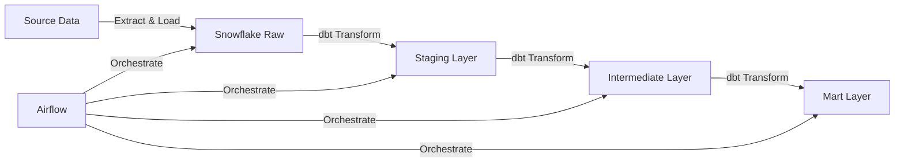

# modern-elt-pipeline
[](https://www.getdbt.com)
[](https://www.snowflake.com)
[](https://airflow.apache.org)

[](https://opensource.org/licenses/MIT)

A modern ELT (Extract, Load, Transform) pipeline implementation using dbt, Snowflake, and Apache Airflow. This project demonstrates industry best practices for data engineering, including dimensional modeling, testing, and orchestration.

## 🔑 Key Features

- **Modern ELT Architecture**: Leverages Snowflake's compute power for transformations
- **Dimensional Modeling**: Implementation of fact tables and data marts
- **Automated Testing**: Built-in data quality checks and custom test cases
- **Airflow Orchestration**: Using Astronomer's Cosmos for dbt integration
- **RBAC Implementation**: Snowflake role-based access control
- **Modular Design**: Separated staging, intermediate, and mart layers

## 🏗️ Architecture



## 📦 Technologies

- **dbt**: Data transformation and modeling
- **Snowflake**: Cloud data warehouse
- **Apache Airflow**: Workflow orchestration
- **Astronomer Cosmos**: dbt-Airflow integration
- **Python**: 3.8+

## 🚀 Quick Start

1. **Clone the repository**
   ```bash
   git clone https://github.com/yourusername/modern-elt-pipeline.git
   cd modern-elt-pipeline
   ```

2. **Install dependencies**
   ```bash
   pip install -r requirements.txt
   ```

3. **Configure Snowflake**
   ```sql
   -- Run in Snowflake
   create warehouse dbt_wh with warehouse_size='x-small';
   create database if not exists dbt_db;
   create role if not exists dbt_role;
   grant usage on warehouse dbt_wh to role dbt_role;
   grant all on database dbt_db to role dbt_role;
   ```

4. **Setup dbt**
   ```bash
   dbt init data_pipeline
   ```

5. **Configure Airflow**
   ```bash
   mkdir dbt-dag
   astro dev init
   astro dev start
   ```

## 📁 Project Structure

```
modern-elt-pipeline/
├── dbt/
│   ├── models/
│   │   ├── staging/
│   │   │   ├── stg_tpch_orders.sql
│   │   │   ├── stg_tpch_line_items.sql
│   │   │   └── tpch_sources.yml
│   │   └── marts/
│   │       ├── intermediate/
│   │       └── fct_orders.sql
│   ├── macros/
│   │   └── pricing.sql
│   ├── tests/
│   └── dbt_project.yml
├── airflow/
│   └── dags/
│       └── dbt_dag.py
├── requirements.txt
├── Dockerfile
└── README.md
```

## ⚙️ Configuration

### dbt Profile
```yaml
models:
  snowflake_workshop:
    staging:
      materialized: view
    marts:
      materialized: table
```

### Airflow Connection
Utilized GCP

```json
{
    "account": "<account_locator>-<account_name>",
    "warehouse": "dbt_wh",
    "database": "dbt_db",
    "role": "dbt_role",
    "insecure_mode": false
}
```

## 🧪 Testing

Run the dbt tests:
```bash
dbt test
```

Run specific tests:
```bash
dbt test --select test_type:singular
```

## 📊 Data Models

### Staging Models
- `stg_tpch_orders`: Clean order data
- `stg_tpch_line_items`: Processed line items with surrogate keys

### Mart Models
- `fct_orders`: Core fact table with order metrics
- `int_order_items`: Intermediate table for order analysis

## 🛠️ Development

1. Create a new branch:
   ```bash
   git checkout -b feature/your-feature-name
   ```

2. Make your changes and commit:
   ```bash
   git commit -m "Add your feature description"
   ```

3. Push to your branch:
   ```bash
   git push origin feature/your-feature-name
   ```

4. Create a Pull Request

## 📝 License

This project is licensed under the MIT License - see the [LICENSE](LICENSE) file for details.

## 🤝 Contributing

1. Fork the Project
2. Create your Feature Branch (`git checkout -b feature/AmazingFeature`)
3. Commit your Changes (`git commit -m 'Add some AmazingFeature'`)
4. Push to the Branch (`git push origin feature/AmazingFeature`)
5. Open a Pull Request

## ✨ Acknowledgments

- [dbt Documentation](https://docs.getdbt.com/)
- [Snowflake Documentation](https://docs.snowflake.com/)
- [Apache Airflow Documentation](https://airflow.apache.org/docs/)
- [Astronomer Cosmos](https://github.com/astronomer/astronomer-cosmos)
- [GCP/Snowflake Documentation](https://docs.snowflake.com/en/user-guide/data-load-gcs-config)
